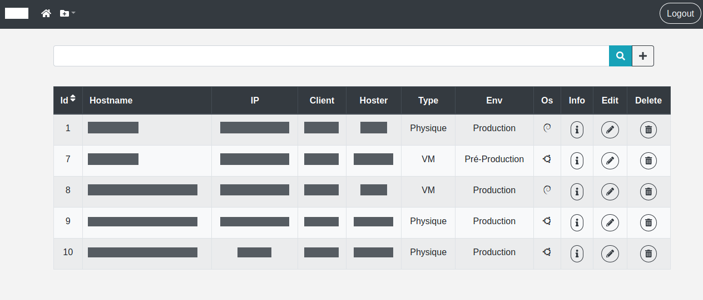

PBO3 (beta)
===
[](https://vuejs.org/)
[](https://twitter.com/pg3io/)
[](LICENCE)

# Introduction
PBO3 est un outil d'inventaire de parc serveur, basé sur le Headless CMS [Strapi](https://github.com/strapi/strapi).



# Fonctions
* Listing (exemple):
  * Serveur (ns1.pg3.xyz,ns2.pg3.xyz, ...)
  * Hosteur/Datacenter (Scaleway DC5, OVH GRA1, ...)
  * OS (Debian Buster, Ubuntu 18.04, ...)
  * Clients (Sonos, Yubikey, ...)
  * Environnement (Production, Staging, ...)
  * Type (VM, Physique, ...)
  * Services (docker, nginx, mariadb, ...)
* Champs de recherche multi-fonction
  * Recherche
  * Ajout
  * Suppression
  * Édition

# Prérequis
* Strapi avec le schéma => [ici (wiki)](https://github.com/pg3io/pbo3/wiki/Strapi)
* Le module graphQL de Strapi

# Démarrage rapide
Déclarer l'url de votre API dans le docker-compose.yml => ``graphEndpoint``
```
docker-compose up
```

# Contributeurs

* [Vue.js](https://vuejs.org/)
* [Bootstrap](https://getbootstrap.com/)
* [Bootsrap-vue](https://bootstrap-vue.org/)
* [Vue-multiselect](https://vue-multiselect.js.org/)
* [Vuelidate](https://vuelidate.js.org/)
* [Fontawesome](https://fontawesome.com/)
* [Font-logos](https://github.com/lukas-w/font-logos)
* [Graphql](https://graphql.org/)

# License
Ce projet est sous licence [Apache 2.0](https://www.apache.org/licenses/LICENSE-2.0) consulter le fichier [LICENSE](LICENSE) pour plus de détails.

# Informations sur l'auteur
Ce projet a été créé par [PG3](https://pg3.io) en septembre 2020.
